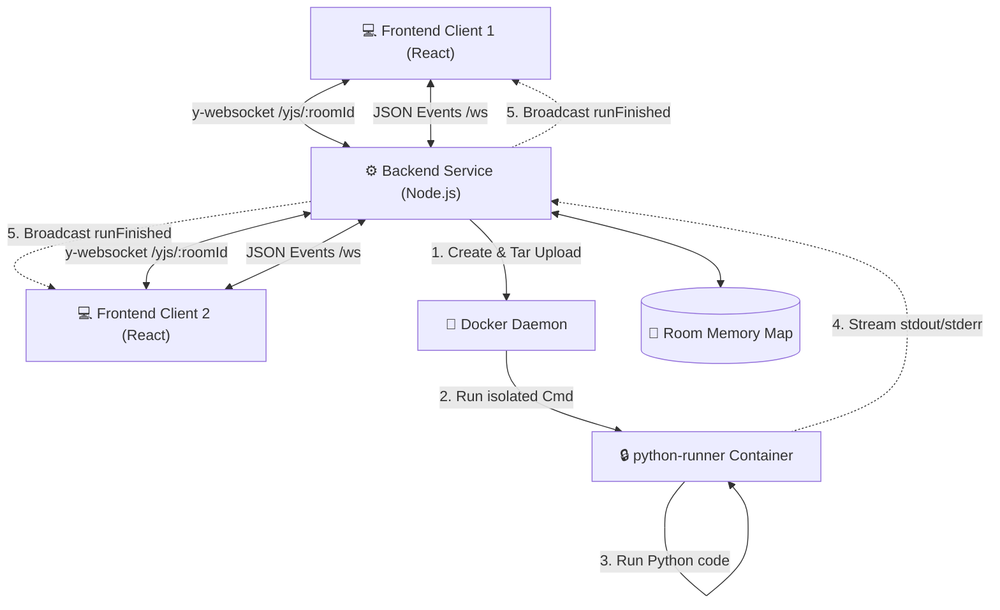

# 🚀 Collab Code Platform (CodeRoom)

[](https://react.dev/)
[](https://nodejs.org/)
[](https://www.docker.com/)
[](https://yjs.dev/)

**Collab Code Platform** (или **CodeRoom**) — это современная веб-платформа для совместного написания и безопасного изолированного запуска Python-кода в реальном времени. Проект спроектирован для использования в учебных комнатах, проведения интерактивных интервью и совместной работы.

---

## ✨ Основные возможности

*   **Совместное редактирование в реальном времени (CRDT):** Реализовано на базе Yjs и Monaco Editor. Все изменения мгновенно синхронизируются между участниками с поддержкой awareness-курсоров (отображение положения курсора и выделений других пользователей с их именами и индивидуальными цветами).
*   **Виртуальная файловая система:** Возможность создания, переименования и удаления файлов форматов `.py` и `.txt` внутри комнаты. Поддерживается автоопределение подсветки синтаксиса.
*   **Изолированный Sandbox для запуска кода:** Запуск кода происходит в изолированных Docker-контейнерах с жесткими лимитами на ресурсы (CPU, RAM, сеть, время выполнения).
*   **Интерактивный контроль выполнения:** Кнопка «Stop» позволяет мгновенно прервать выполнение зависшего или бесконечного скрипта (посылается сигнал отмены в Docker API).
*   **Синхронный вывод:** Результаты выполнения (`stdout`, `stderr` и статус выполнения) транслируются всем участникам комнаты в реальном времени.
*   **Самоочистка:** Комнаты, в которых нет активных участников, автоматически удаляются по истечении заданного времени (TTL) для освобождения памяти.

---

## 🏗️ Архитектура системы

Платформа состоит из трех ключевых компонентов:
1.  **Frontend (React + Vite):** Клиентское SPA, использующее Monaco Editor для редактирования и библиотеку Yjs (`y-monaco`, `y-websocket`) для синхронизации.
2.  **Backend (Node.js + TS):** Express-сервер, который управляет WebSocket-соединениями, координирует состояние комнат и взаимодействует с Docker Engine API.
3.  **Runner (Docker):** Легковесный базовый образ на основе `python:3.12-slim`, используемый как песочница для разовых запусков кода.

### Диаграмма взаимодействия компонентов



---

## 🔒 Модель безопасности Sandbox

Безопасность выполнения пользовательского кода является приоритетом. Для предотвращения несанкционированного доступа к хост-системе, утечек данных и DoS-атак, запуск Python-файлов реализован следующим образом:

1.  **Прямое взаимодействие с Docker API:** Backend общается с локальным сокетом Docker (`/var/run/docker.sock` или Named Pipe на Windows) напрямую через протокол HTTP, минуя вызовы CLI-утилит (shell).
2.  **In-Memory сборка архива:** Файлы пользователя не сохраняются на диск хоста перед запуском. Backend упаковывает все файлы комнаты в `.tar` архив прямо в оперативной памяти и загружает его в контейнер через API-метод `/containers/:id/archive`.
3.  **Изоляция сети:** Для контейнера выполнения устанавливается режим `NetworkMode: "none"`. Код не может совершать внешние запросы или скачивать сторонний софт.
4.  **Ограничение ресурсов:**
    *   **RAM:** Ограничена до **128 MB** (защита от утечек памяти).
    *   **CPU:** Ограничен до **0.5 CPU** (500,000,000 NanoCPUs, защита от 100% утилизации ядер процессора).
5.  **Таймаут выполнения:** Скрипт принудительно завершается через **15 секунд** (настраивается через `RUN_TIMEOUT_MS`).
6.  **Лимит вывода:** Вывод `stdout`/`stderr` ограничен до **64 KB** (настраивается через `RUN_OUTPUT_LIMIT_BYTES`). При превышении выполнение останавливается.
7.  **Очистка контейнеров:** Контейнер автоматически удаляется (`force=1&v=1`) сразу после завершения работы программы.

> [!WARNING]
> В продакшене проброс `/var/run/docker.sock` внутрь backend-контейнера предоставляет backend-процессу полные права администратора над Docker-демоном хоста. В публичных проектах рекомендуется запускать Docker Runner на отдельном изолированном виртуальном сервере или использовать gVisor/Kata Containers для дополнительной изоляции.

---

## 📂 Структура проекта

```text
CodeRoom/
├── backend/                  # Node.js + TypeScript сервер
│   ├── src/
│   │   ├── index.ts          # Express инициализация, REST API
│   │   ├── rooms.ts          # Логика комнат, файлов, TTL таймеров
│   │   ├── realtime.ts       # Обработка WebSocket (JSON API и Yjs протоколы)
│   │   ├── runner.ts         # Интеграция с Docker Engine API, сборка .tar, запуск песочниц
│   │   └── types.ts          # Общие типы данных TypeScript
│   ├── Dockerfile
│   └── tsconfig.json
│
├── frontend/                 # Клиентское React-приложение (Vite)
│   ├── src/
│   │   ├── pages/            # Страницы приложения (HomePage, RoomPage)
│   │   ├── config.ts         # Конфигурация WebSocket/API URL
│   │   ├── styles.css        # Глобальные стили (темная тема, кастомный UI)
│   │   └── main.tsx
│   ├── index.html
│   ├── nginx.conf            # Конфигурация Nginx для Docker-сборки
│   └── vite.config.ts
│
├── runner/                   # Docker-образ для выполнения кода
│   └── Dockerfile            # Базируется на python:3.12-slim
│
├── docker-compose.yml        # Конфигурация для локальной разработки
├── docker-compose.prod.yml   # Конфигурация для продакшена
└── package.json              # Скрипты запуска проекта
```

---

## 🛠️ Инструкция по запуску

### Требования
*   Установленный **Node.js** (v18+)
*   Установленный **Docker** и запущенный Docker-демон (Docker Desktop на Windows/macOS должен быть активен)

### Быстрый запуск (Рекомендуемый)

Для автоматической установки и параллельного запуска frontend и backend в режиме разработки:

1.  Соберите образ ранера:
    ```bash
    docker build -t collab-python-runner ./runner
    ```
2.  Установите все зависимости:
    ```bash
    npm run install:all
    ```
3.  Запустите проекты:
    ```bash
    npm run dev
    ```

После этого:
*   Frontend будет доступен по адресу: `http://localhost:5173`
*   Backend будет доступен по адресу: `http://localhost:4000`

---

### Альтернативный ручной запуск по компонентам

#### 1. Сборка Sandbox Runner
```bash
docker build -t collab-python-runner ./runner
```

#### 2. Запуск Backend
```bash
cd backend
npm install
npm run dev
```

#### 3. Запуск Frontend
```bash
cd frontend
npm install
npm run dev
```

---

### Запуск через Docker Compose (Локально)

Вы можете запустить всю инфраструктуру одной командой. Перед этим убедитесь, что вы собрали runner:
```bash
docker build -t collab-python-runner ./runner
docker compose up --build
```

---

## ⚙️ Конфигурация (Окружение)

### Backend (`backend/.env` или переменные окружения Compose)

| Переменная | Описание | Значение по умолчанию |
| :--- | :--- | :--- |
| `PORT` | Порт запуска Express сервера | `4000` |
| `ALLOWED_ORIGINS` | Необязательный список origins для cross-origin разработки, через запятую | Не задан (CORS выключен) |
| `RUNNER_IMAGE` | Имя Docker-образа для песочницы | `collab-python-runner` |
| `DOCKER_SOCKET` | Путь к сокету Docker API | Windows: Named Pipe, Linux/macOS: `/var/run/docker.sock` |
| `RUN_TIMEOUT_MS` | Максимальное время выполнения кода (мс) | `15000` (15 сек) |
| `RUN_OUTPUT_LIMIT_BYTES` | Лимит размера вывода программы (байт) | `65536` (64 KB) |

### Frontend (`frontend/.env` или Vite ENV)

| Переменная | Описание | Значение по умолчанию |
| :--- | :--- | :--- |
| `VITE_API_BASE_URL` | Базовый URL REST API; можно переопределить локально | `/api` |
| `VITE_WS_BASE_URL` | Базовый WebSocket URL; можно переопределить локально | Текущий host и автоматический `ws://`/`wss://` |

---

## 📡 API и протоколы взаимодействия

### REST API Эндпоинты

*   `GET /health` — Проверка жизнеспособности сервера. Возвращает `{ "ok": true }`.
*   `POST /api/rooms` — Инициализирует новую комнату. Возвращает идентификатор комнаты `{ "roomId": "8-char-id" }`.
*   `GET /api/rooms/:roomId` — Получение полной информации о текущем состоянии комнаты (активный файл, список файлов, контент, пользователи, последний запуск).
*   `POST /api/rooms/:roomId/run` — Запуск кода выбранного файла. Принимает JSON `{ "fileId": "file-id" }`.

### WebSocket протоколы

#### 1. Yjs Sync WS (`/yjs/:roomId`)
Использует бинарный протокол `y-protocols` (`sync` и `awareness`) для посимвольной синхронизации контента Monaco Editor и отображения удаленных курсоров.

#### 2. JSON Events WS (`/ws`)
Координирует структуру комнаты, состав участников и процессы запуска кода.

**Формат сообщений клиента (Client to Server):**
*   `joinRoom`: `{ type: "joinRoom", roomId, clientId, name, color }`
*   `leaveRoom`: `{ type: "leaveRoom", roomId, clientId }`
*   `createFile`: `{ type: "createFile", roomId, name }`
*   `renameFile`: `{ type: "renameFile", roomId, fileId, name }`
*   `deleteFile`: `{ type: "deleteFile", roomId, fileId }`
*   `selectFile`: `{ type: "selectFile", roomId, fileId }`
*   `runCode`: `{ type: "runCode", roomId, fileId, content? }`
*   `stopCode`: `{ type: "stopCode", roomId }`

**Формат сообщений сервера (Server to Client):**
*   `roomState`: Возвращает актуальные файлы и метаданные при подключении.
*   `usersUpdated`: Обновляет список активных участников.
*   `filesUpdated`: Сигнализирует об изменении структуры файлов (создан/удален/переименован).
*   `activeFileUpdated`: Указывает текущий открытый файл.
*   `runStarted` / `runFinished`: Транслирует начало и результат работы песочницы.
*   `error`: Уведомления об ошибках валидации или сбоях.

---

## 🚢 Деплой на Production (Стенд)

Сборка для эксплуатации запускается через `docker-compose.prod.yml`.

1.  Соберите runner-контейнер на целевом сервере:
    ```bash
    docker build -t collab-python-runner ./runner
    ```
2.  Проверьте конфигурацию: `docker compose -f docker-compose.prod.yml config`.
3.  Запустите стек:
    ```bash
    docker compose -f docker-compose.prod.yml up -d --build
    ```

### 🔒 Настройка Reverse Proxy (Nginx)

Используйте готовый файл `nginx.code-room.conf`: он маршрутизирует `/` на
frontend, сохраняет `/api/*` при передаче в backend и отдельно проксирует `/ws`
и `/yjs/*` с WebSocket-заголовками. Полные команды установки, проверки и
перезапуска приведены в `DEPLOY.md`.

---

## 🗺️ Что можно улучшить (Roadmap)

*   [ ] **Персистентность данных:** Интеграция базы данных (например, PostgreSQL/Redis) для сохранения состояния файлов и комнат после перезагрузки бэкенда.
*   [ ] **Авторизация пользователей:** Добавление системы учетных записей (OAuth / JWT) и разделения ролей (Создатель / Зритель / Редактор).
*   [ ] **Поддержка других языков:** Расширение линейки ранеров для поддержки JavaScript (Node.js), Go, Bash.
*   [ ] **Автовосстановление WebSocket:** Реализация автоматического переподключения (reconnect/backoff) при сбоях сети с сохранением оффлайн-изменений.
*   [ ] **Усиленный Sandbox:** Интеграция виртуализации на уровне микро-ВМ (например, Firecracker или gVisor) для безопасного выполнения в публичной среде.
